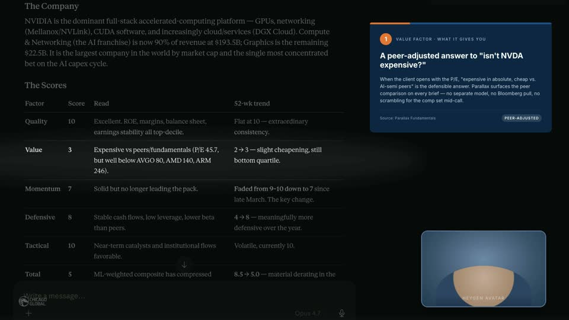
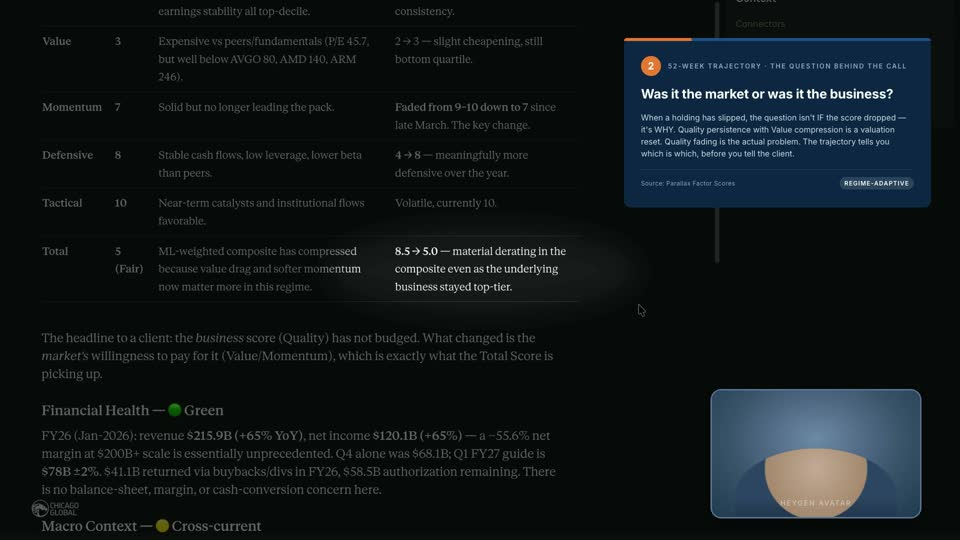
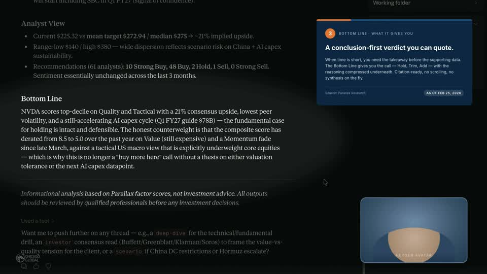

# Review report — V1

- **Model:** `claude-opus-4-7`
- **Generated:** 2026-06-13T12:28:26+00:00
- **Summary:** 9 pass · 1 warn · 7 error
- **Total findings:** 17

## Token usage + cost

| Metric | Value |
|---|---|
| API calls | 0 |
| Cache hits (free) | 13 |
| Input tokens (uncached) | 0 |
| Cache-read tokens | 0 |
| Cache-write tokens | 0 |
| Output tokens | 0 |
| **Estimated cost USD** | **$0.0000** |

## R01 — Subject-match (spotlight vs panel)

### ✓ `ap1` — pass — The frame shows a dimmed overlay across most of the score table, with the Value row (Value, 3, 'Expensive vs peers/funda

**Spotlit content (frame):** The Value row of the Scores table: 'Value | 3 | Expensive vs peers/fundamentals (P/E 45.7, but well below AVGO 80, AMD 140, ARM 246) | 2 → 3 — slight cheapening, still bottom quartile.'

**Panel pitches:** Value Factor panel arguing Parallax surfaces a peer-adjusted answer to the 'NVDA is expensive' objection — expensive in absolute terms but cheap vs AI-semi peers, with peer comparison on every brief.

**Reasoning:** The frame shows a dimmed overlay across most of the score table, with the Value row (Value, 3, 'Expensive vs peers/fundamentals (P/E 45.7, but well below AVGO 80, AMD 140, ARM 246)', '2 → 3 — slight cheapening, still bottom quartile') appearing as the brightest/most legible row. The paired panel pitches the Value Factor and the peer-adjusted answer to 'isn't NVDA expensive?' — explicitly highlighting peer comparison (AVGO/AMD/ARM P/E context). The spotlit Value row contains exactly that peer-comparison content, satisfying the panel's pitch. Spotlight center sits roughly in the middle vertical band of the composition, within the safe zone.

### ✓ `ap2` — pass — The bright/spotlit area is centered on the Total row's trajectory cell showing '8.5 → 5.0 — material derating in the com

**Spotlit content (frame):** The Total row's trajectory/52-week cell showing '8.5 → 5.0 — material derating in the composite even as the underlying business stayed top-tier.' Surrounding rows and body text are dimmed.

**Panel pitches:** The panel frames the 52-week trajectory as the diagnostic for whether a score drop reflects a market reset (Value compression with Quality persistence) or an actual business problem (Quality fading) — pointing the viewer to the Total trajectory cell to see which pattern this name fits.

**Reasoning:** The bright/spotlit area is centered on the Total row's trajectory cell showing '8.5 → 5.0 — material derating in the composite even as the underlying business stayed top-tier.' The panel pitches the 52-week trajectory and the question of whether market or business drove the score change. The sub-annotate beat note explicitly calls for focus on the Total row's 52-wk trend cell (8.5 → 5.0), which is exactly what is illuminated. The spotlight sits in the vertical safe zone and tightly bounds the specific cell the VO names.

### ✓ `ap3` — pass — The bright/in-focus area covers the Bottom Line header and the opening lines of its paragraph ('NVDA scores top-decile o

**Spotlit content (frame):** The 'Bottom Line' header and the first several lines of its paragraph, naming NVDA as top-decile Quality/Tactical with 21% consensus upside and lowest peer volatility — the conclusion-first verdict text.

**Panel pitches:** Panel #3 pitches the Bottom Line as a conclusion-first, quotable verdict (Hold/Trim/Add) with compressed reasoning beneath — citation-ready, no scrolling needed.

**Reasoning:** The bright/in-focus area covers the Bottom Line header and the opening lines of its paragraph ('NVDA scores top-decile on Quality and Tactical with a 21% consensus upside, lowest peer volatility...'), which directly matches the panel's pitch about the Bottom Line giving a conclusion-first verdict (Hold/Trim/Add) with compressed reasoning. The Analyst View section above and the disclaimer/used-a-tool section below are visibly dimmer. The spotlight sits in the vertical mid-band as required.

## R02 — Customer's-chair framing (panel copy)

### ✓ `ap1` — customer's-chair framing OK

all fields speak from the buyer's chair

### ✓ `ap2` — customer's-chair framing OK

all fields speak from the buyer's chair

### ✓ `ap3` — customer's-chair framing OK

all fields speak from the buyer's chair

## R03 — Panel shape rotation

### ✓ `all_panels` — all panels classified, no consecutive same-shape

- **ap1**: *capability* — Eyebrow explicitly says 'WHAT IT GIVES YOU' and body pitches what Parallax surfaces on every brief — a peer-adjusted answer the buyer gets.
- **ap2**: *stakes* — Body frames what's on the line: distinguishing a valuation reset from an actual quality problem before talking to the client. The consequence of getting the diagnosis right is the angle.
- **ap3**: *capability* — Eyebrow says 'WHAT IT GIVES YOU'; body pitches what the Bottom Line gives — a quotable, citation-ready verdict with reasoning compressed underneath.

## R04 — Vault stats integrate-not-narrate

### ✗ `vo_body` — 1 vault-stat violation(s)

- *"You type the question in plain English, and Parallax pulls every input — scores, peers, macro, news, methodology — through the same factor framework. Thirteen years live, out-of-sample."*
  - **Problem:** 'Thirteen years live, out-of-sample' is recited as standalone credibility prose about the framework itself, not anchored to a specific output element the viewer is looking at. It's a scale/track-record claim floating in the methodology description.

## R05 — Beat content visible in recording

### ⚠ `-` — MASTER.md beat sheet not parseable

no beat-sheet table found for V1

## R06 — Hallucination check (frames_used)

### ✗ `frame_0001.jpg` — fail — The cite claims the quick-prompts are 'Deep dive analysis / Build scored portfolio / Analyze investor profile', but the 

**Cite:** "empty Cowork chrome with 'Let's knock something off your list' greeting + brand quick-prompts (Deep dive analysis / Build scored portfolio / Analyze investor profile)"

**Visible content:** Cowork app with greeting 'Let's knock something off your list', input box 'How can I help you today?', Work in a project / Opus 4.7 selectors, and three quick-prompts under 'Get to work with Parallax': Research and compare ETFs, Build scored portfolio, Research stock brief.

**Reasoning:** The cite claims the quick-prompts are 'Deep dive analysis / Build scored portfolio / Analyze investor profile', but the frame actually shows 'Research and compare ETFs / Build scored portfolio / Research stock brief'. Two of the three prompt labels are wrong.

### ✗ `frame_0008.jpg` — fail — The cite claims the user prompt reads 'Stock brief on NVDA. Client query, need a defensible read on the position.' but t

**Cite:** "user prompt visible 'Stock brief on NVDA. Client query, need a defensible read on the position.' + Working state + Running skill / Loading tools indicators + Progress sidebar appearing"

**Visible content:** Cowork interface with task 'NVIDIA stock hype evaluation'. User prompt: 'I keep hearing about NVIDIA, can you give me a quick rundown on whether it's actually worth the hype right now?' Working indicator visible with three 'Get stock outlook' skill calls. Progress sidebar on right with two checkmarks and one pending. Context panel shows Parallax connector and stock skill.

**Reasoning:** The cite claims the user prompt reads 'Stock brief on NVDA. Client query, need a defensible read on the position.' but the actual visible prompt in the frame is 'I keep hearing about NVIDIA, can you give me a quick rundown on whether it's actually worth the hype right now?' This is a complete mismatch of the prompt text. The Working state, skill running indicators (Get stock outlook x3), and Progress sidebar are present, but the core cited prompt text is wrong.

### ✗ `frame_0023.jpg` — fail — The cited content describes the initial brief delivery with header 'NVDA — Stock Brief', price/cap/PE line, factor table

**Cite:** "brief delivered — 'Used Parallax integration, used 13 tools, used a skill' + 'NVDA — Stock Brief (NVIDIA Corp, NVDA.O)' + 'Price $225.32 · Mkt Cap $5.46T · P/E 45.7 · Today −4.4%' + Progress sidebar 5-of-5 complete + factor table (Quality 10, Value 3, Momentum 7, Defensive 8, Tactical 10)"

**Visible content:** Lower portion of the NVDA brief showing peer comparison text (AMD/MU/AVGO returns), 'Recent News' section (Q4 FY2026 $68.1B, Q1 China exclusion, Vera Rubin platform), 'Analyst View' (9 Strong Buy, 2 Hold, 1 Sell, target $265, mean $268), and 'Bottom Line' paragraph. Progress sidebar shows 'See task progress for longer tasks.' Context panel shows Parallax connector and stock skill. No header, no price line, no factor table visible in this frame.

**Reasoning:** The cited content describes the initial brief delivery with header 'NVDA — Stock Brief', price/cap/PE line, factor table (Quality 10, Value 3, etc.), and a 5-of-5 progress sidebar. The frame instead shows the later 'Bottom Line' and 'Analyst View' / 'Recent News' sections of the brief. There is no visible header line, no price/Mkt Cap/PE line, no factor table, and no 5-of-5 progress checklist visible. The Progress sidebar shows only 'See task progress for longer tasks' — not the 5-step checklist.

### ✗ `frame_0026.jpg` — frame file missing: frame_0026.jpg

/Users/ongyanchao/Desktop/Chicago Global/product-demo-videos/frames/V1/frame_0026.jpg not on disk; re-run extract_frames.py

### ✗ `frame_0027.jpg` — frame file missing: frame_0027.jpg

/Users/ongyanchao/Desktop/Chicago Global/product-demo-videos/frames/V1/frame_0027.jpg not on disk; re-run extract_frames.py

### ✗ `frame_0030.jpg` — frame file missing: frame_0030.jpg

/Users/ongyanchao/Desktop/Chicago Global/product-demo-videos/frames/V1/frame_0030.jpg not on disk; re-run extract_frames.py

### ✓ `frame_0015.jpg` — pass — The frame shows multiple sub-processes in the chat: 'List macro countries' (Result), 'Macro analyst' (Request), 'Explain

**Cite:** "continued parallel work in chat — multiple sub-processes visible, Progress sidebar populating"

**Visible content:** Chat shows multiple sub-tasks: List macro countries (Result), Macro analyst (Request), Explain methodology (Request), plus permission prompt 'Claude wants to use Macro analyst from Parallax'. Right sidebar shows Progress section with two checkmarks and a pending indicator.

**Reasoning:** The frame shows multiple sub-processes in the chat: 'List macro countries' (Result), 'Macro analyst' (Request), 'Explain methodology' (Request), and a Claude permission prompt for Macro analyst. The Progress sidebar is visible on the right with progress indicators (checkmarks and a pending circle). This matches the cite text.

### ✓ `frame_0022.jpg` — pass — The frame shows a Progress sidebar on the right with what appears to be checkmark indicators (two filled circles with ch

**Cite:** "brief nearly complete — Progress sidebar near full, brief page rendering"

**Visible content:** Brief page with sections (Macro Context, Dividends, Risk vs. Peers, Recent News, Analyst View) fully rendered; Progress sidebar visible on right with completion indicators (checkmarks).

**Reasoning:** The frame shows a Progress sidebar on the right with what appears to be checkmark indicators (two filled circles with checkmarks visible), indicating near completion. The brief content is fully rendered showing sections like Macro Context, Dividends, Risk vs. Peers, Recent News, and Analyst View with detailed analysis.

